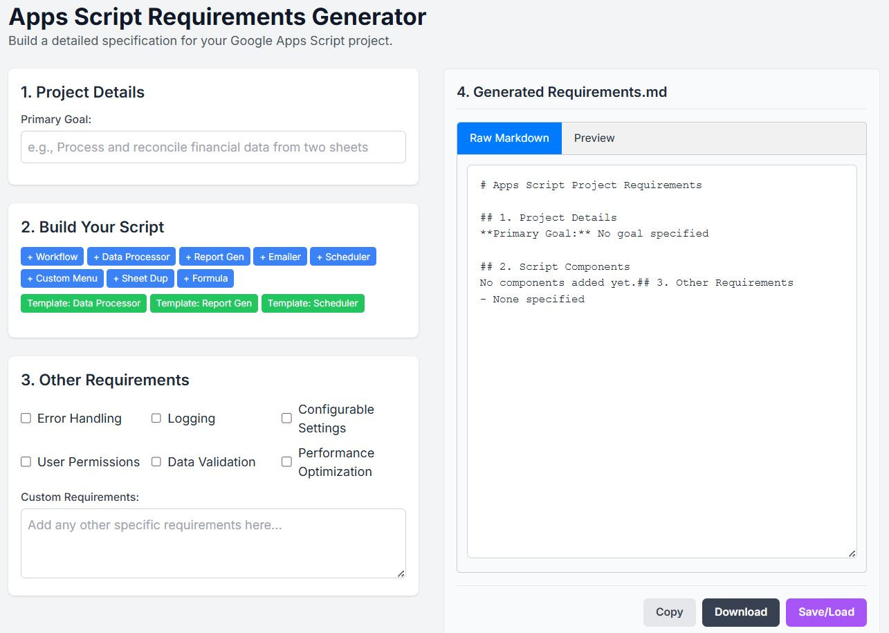

# Apps Script Requirements Generator

## 📖 Overview

The **Apps Script Requirements Generator** is a web-based tool designed to help users create detailed and well-structured requirements documents for Google Apps Script projects. It provides an intuitive interface for defining project goals, adding various script components, specifying non-functional requirements, and generating a clean Markdown summary that can be used as a project specification.

This tool streamlines the initial phase of project development by ensuring all key aspects of the script are considered and documented in a consistent format.

*Application Screenshot:*

---

## ✨ Features

-   **Project Goal Definition:** Clearly state the primary objective of your Apps Script project.
-   **Component-Based Building:** Add various pre-defined components to build your script's specification, including:
    -   **Workflows:** Define sequences of actions with multiple steps.
    -   **Data Processing:** Specify logic for transforming, validating, or aggregating data.
    -   **Triggers & UI:** Configure custom menus, sidebars, and triggers (onEdit, time-based).
    -   **Sheet Operations:** Detail requirements for creating, copying, or manipulating sheets and ranges.
    -   **Communication:** Outline email notifications and report generation tasks.
-   **Dynamic UI:** The interface updates dynamically, allowing you to link workflows to triggers and UI elements seamlessly.
-   **Non-Functional Requirements:** Easily add common requirements like performance optimization, error handling, and user feedback.
-   **AI-Powered Enhancement (Simulated):** A feature to "enhance" text descriptions, turning simple notes into more formal specifications.
-   **Live Markdown Preview:** See the generated `requirements.md` file update in real-time as you build your specification.
-   **Copy to Clipboard:** Quickly copy the generated Markdown to use in your project documentation or version control system.

---

## 🚀 How to Use

1.  **Open the `index.html` file** in your web browser.
2.  **Define the Project Goal:** In the "Primary Goal" input field, write a concise sentence describing what you want your script to achieve.
3.  **Add Components:**
    -   Use the "Select a component to add..." dropdown to choose a feature (e.g., Workflow, Data Processor, Custom Menu).
    -   Click the **Add** button. A new card for that component will appear below.
    -   Fill in the details for each component. For example, name your workflows, describe data processing logic, or define menu items.
4.  **Build Workflows and UI:**
    -   When creating components like a **Custom Menu** or **On Edit Trigger**, you can link them to a **Workflow** you've already defined using the dropdowns provided.
    -   Workflows themselves can be built by adding steps like "Read Data" or "Write Data".
5.  **Specify Other Requirements:**
    -   Check the boxes for any non-functional requirements like "Performance Optimization" or "Robust Error Handling".
    -   Add any other specific needs in the "Custom Requirements" text area.
6.  **Review the Generated Markdown:** The text area on the right will update in real-time with your formatted requirements.
7.  **Copy the Markdown:** Once you are satisfied, click the **Copy** button to copy the entire `requirements.md` content to your clipboard.

---

## 🛠️ Technologies Used

-   **HTML5:** For the basic structure of the application.
-   **Tailwind CSS:** For all styling and layout, providing a modern and responsive design.
-   **JavaScript (ES6+):** For all the application logic, including DOM manipulation, event handling, and dynamic content generation.
-   **Google Fonts (Inter):** For a clean and readable typography.

---

## 🔬 Key Functionality Explained

The application's logic is contained within the `<script>` tag in the HTML file. Here are some of the core functions:

-   `addFeature()`: Creates and appends a new feature card to the UI based on the user's selection from the dropdown.
-   `removeFeature(featureId)`: Removes a feature card from the UI.
-   `updateMarkdown()`: The central function that reads all the data from the input fields and component cards and compiles it into the final Markdown output. It is called almost every time an input changes.
-   `generateFeatureMarkdown(feature)`: A helper function for `updateMarkdown()` that generates the Markdown string for a single feature card.
-   `intelligentEnhanceText(originalText)`: A simulated asynchronous function that reformats user input into a more structured specification.
-   **Dynamic Template Objects (`featureTemplates`, `stepTemplates`):** These JavaScript objects store HTML string templates for each type of component, making it easy to add new features.